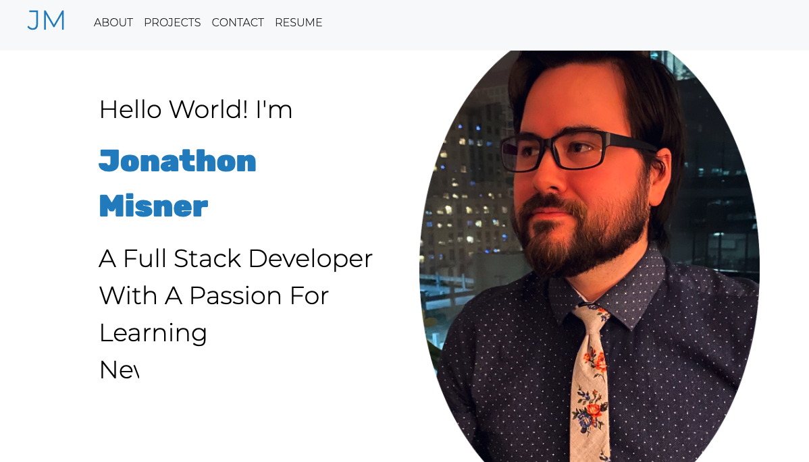
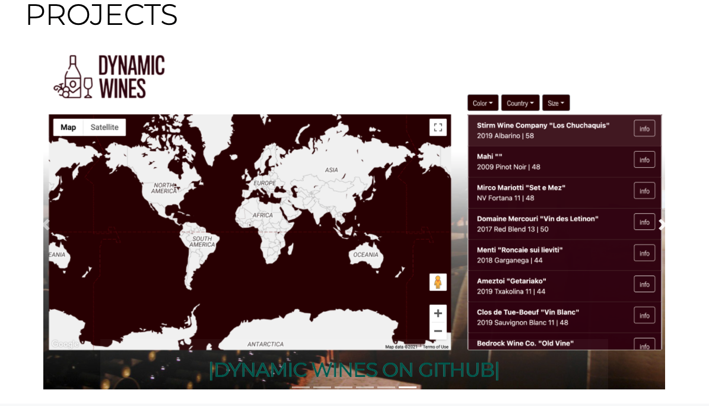
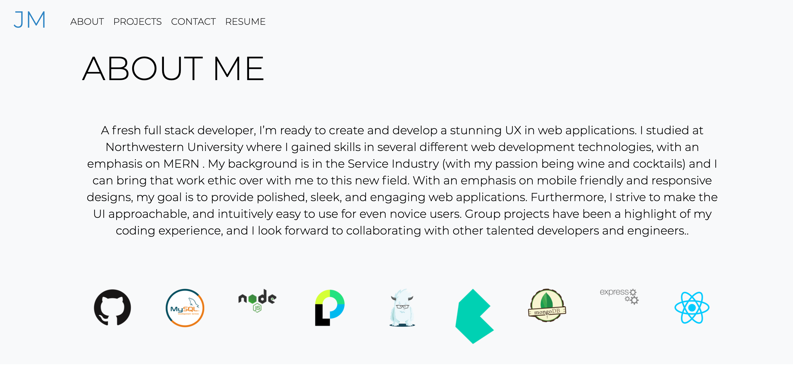
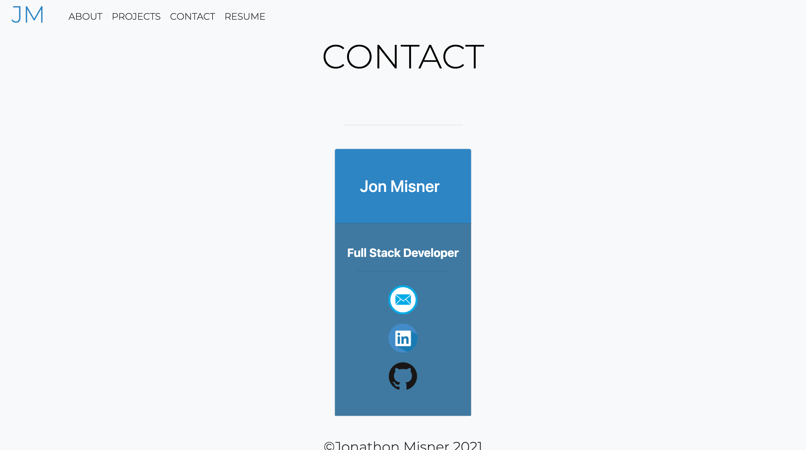

# Portfolio2021 
  
***
 
  ## Description

    Created a new Portfolio for the new(ish) year. Used React, along with Node, Reacstrap, CSS, and more.

    
     
    
    

***

  ## Table of Contents

  * [Description](#description)
  * [Contributors](#contributors)
  * [Contact Information](#email)
  * [License](#license)

***
  ## Contributors

     Jon Misner
     Inspired by the portfolio of Alexandra Hionis

***
  ## Contact Information

     Github: JonMisner 
     Email: jonmisner86@gmail.com
***
    ### License: MIT
***  